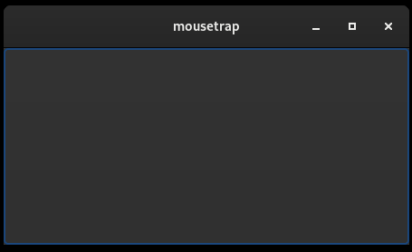

# Chapter 3: Signals

In this chapter, we will learn:
+ What signals are
+ How to connect to a signal
+ How and why to block a signal

## Introduction: Signal Architecture

Central to mousetrap, GTK and many GUI libraries like QT is what is called signal architecture or [signal programming](https://en.wikipedia.org/wiki/Signal_programming).

A signal has 3 components:
+ an **id**, which uniquely identifies it. Ids may not be shared between signals
+ an **emitter**, which is a non-signal object
+ a **callback**, which is a function called when an emitter emits a signal

It may be easiest to consider an example: In the previous chapter on actions, we have learned of `mousetrap::Button` which triggers an action when clicked. However, this is not the only way of connecting behavior to the click of a button. Instead, we can connect to a signal emitted when the button is clicked.

Looking at `mousetrap::Button`s documentation, we see that it inherits from a class called `mousetrap::has_signal_clicked`. like the name suggest, inheriting from this class makes a signal named `clicked` available to the child, `Button` in this case. An object can have any number of signals, as long as they do not share an id. Button has more than just the `clicked` signal, however we will reserve these for later chapters.

Inheriting from `has_signal_clicked` makes the following functions available to a `Button` instance:

+ `Button::connect_signal_clicked`
+ `Button::disconnect_signal_clicked`
+ `Button::emit_signal_clicked`
+ `Button::set_signal_clicked_blocked`
+ `Button::get_signal_clicked_blocked`

We will go through these one-by-one, as every signal will have exactly these functions, with `clicked` replaced by the corresponding signals name, of course.

### Creating a Signal Emitter Instance

To use signals, we first need an emitter. Almost all objects in mousetrap are signal emitters, they are marked as such by inheriting from `mousetrap::SignalEmitter`. This includes an object that inherits from `mousetrap::Widget`. For now, we will restrict ourselves to `mousetrap::Button`. We can use the following main to execute any code snippets in this chapter:

\cpp_code_begin
```cpp
#include <mousetrap.hpp>
using namespace mousetrap;

// global state, holds window and our example button
inline struct State {
    Window window;
    Button button = Button();
} state* = nullptr;

void on_activate()
{
    // all code snippets go here
}

int main()
{
    auto app = Application(example.signals);
    
    // setup
    app.connect_signal_activate([](Application* app) {
        
        // create window and button
        state = new State {Window(*app)};
        
        // execute our code
        on_activate();
        
        // add the button to the window we can interact with it
        state->window.set_child(state->button);
        
        // display the window and start the main loop
        state->window.present();
    });
    
    // cleanup
    app.connect_signal_shutdown([]() {
       delete state; 
    });
    
    return app.run();
}
```

\cpp_code_end

\julia_code_begin
```julia
#todo
```
\julia_code_end

Eagle-eyed readers will notice that we were already using signals in the hello world example from before. Indeed, `mousetrap::Application` is a signal emitter
and we have to use two of it's signals, `activate` and `shutdown`, for even a basic hello world.

## Connecting a Signal Callback

Now that we have our signal emitter, `state->button`, which is a `mousetrap::Button` instance, to connect a callback we 
first need a callback function. This can be any kind of function (such as a static C function or lambda), however its signature
is restricted. Each signal has a corresponding signature, and any callback function has to exactly match that signature.

If the signal emitter is of type T, then the first argument of any callback has to be a `T*`. For example, if the signal emitter 
is a `mousetra::Button`, the functions signature has to have `Button*` as its first arguments.

Subsequent arguments are signal dependend, for `clicked`, no additional arguments are needed. The same is true for the 
return type, for `clicked`, it is `void`.

Lastly, any signal callback can have an optional last argument, usually called `data`. This argument can be of arbitrary 
type and is used to hand callbacks additional user-supplied informations.

Putting it all together, for signal `clicked`, our function has to have the signature `(Button*) -> void` (or `(Button*, Data_t) -> void`, where `Data_t` is an arbitrary data type).
We can then supply this function as the argument to `Buton::connect_signal_clicked`:

<br>
\cpp_code_begin

```cpp
// define callback function with signature (Button*, std::string) -> void
void on_clicked(Button* button, std::string data)
{
    std::cout << data << std::endl;
}

// connect to button instance during main
void on_activate()
{
    state->button.connect_signal_clicked(on_clicked, "clicked");
        // because we supply data of type `std::string`, the second argument type of `on_clicked` has to match 
}
```
\cpp_code_end

\julia_code_begin
```julia
#todo
```
\julia_code_end



Running our main we get a window with a single button. Clicking that button (by pressing the left mouse button while the cursor is over the buttons are) prints `clicked`, as expected.

We can manually trigger the signal callback by call `Button::emit_signal_clicked` on the button instance from inside our own code. This will
also trigger our connected signal handler, just as if it was triggered by the button itself.

In the previous C++ code example we used a static C function with signature `(Button*, std::string) -> void` to connect a signal callback. In mousetrap, we can
also use a C++ lambda, which is highly convenient as it keeps us from polluting the global namespace with functions that are only used in one place: 

\cpp_code_begin
```cpp
state->button.connect_signal_clicked([](Button*, std::string data){
    std::cout << data << std::endl;
}, "clicked");
```
\cpp_code_end

Connecting a lambda as a handler is exactly equivalent to connecting a C function.

## Preventing Signal Emission

We can remove our signal callback with `Button::disconnect_signal_clicked`, however this is rarely necessary. It is also a 
fairly expensive operation that should be avoided unless necessary. Instead, we can *block* the signal. A blocked signal
keeps the signal handler function connected, while preventing execution of it.

For example, by calling

<br>
\cpp_code_begin
```cpp
state->button.set_signal_clicked_blocked(true);
```
\cpp_code_end

\julia_code_begin
```julia
#todo
```
\julia_code_end

The button is still clickable, but clicking it will no longer print "clicked". This is because the emission was blocked.
By setting `set_signal_clicked_blocked` to `true`, we return to previous behavior.

This can be very important, for example, consider the following hypothetical example with two buttons. If the user presses
any 1 of the two, we want both to emit signal clicked. An intuitive way to implement this would be:

\cpp_code_begin
```cpp
static auto button_01 = Button();
static auto button_02 = Button();

button_01.connect_signal_clicked([](Button*) {
   button_02.emit_signal_clicked(); 
   std::cout << "01 clicked" << std::endl;
});

button_02.connect_signal_clicked([](Button*){
    button_01.emit_signal_clicked();
    std::cout << "02 clicked" << std::endl;
});
```
\cpp_code_end

\julia_code_begin
```julia
#todo
```
\julia_code_end

Pressing one of these buttons will deadlock the application. This is because button 01 triggers button 02 which triggers button 01, etc.
By instead blocking the original button before triggering the other, we can get the correct behavior:

\cpp_code_begin
```cpp
static auto button_01 = Button();
static auto button_02 = Button();

button_01.connect_signal_clicked([](Button* self) {
    
    // block self to avoid cycle
    self->set_signal_clicked_blocked(true);
    
    // now emit other
    button_02.emit_signal_clicked(); 
    
    // unblock self again
    self->set_signal_clicked_blocked(false);
    
    std::cout << "01 clicked" << std::endl;
});

button_02.connect_signal_clicked([](Button* self){
    
    self->set_signal_clicked_blocked(true);
    button_01.emit_signal_clicked();
    self->set_signal_clicked_blocked(false);
    
    std::cout << "02 clicked" << std::endl;
});
```
\cpp_code_end

\julia_code_begin
```julia
# todo
```
\julia_code_end

The two buttons will now exhibit the correct behavior.

## Finding a Signals Signature

mousetrap has dozens of different signals, all with their unique signature. It can be hard remembering which class has which 
signals, and which signals take which signatures. 

All of this information is accessible in mousetraps documentation, to aid users who are less familiar with reading documentation,
it may appropriate to work through an example.

@todo linke

Let's say we want to check which signals `mousetrap::Window` has. Navigating to [its documentation page](TODO), we see that inherits multipel signal components:

From it's base `Widget`, `Window` inherits:
+ `realize`
+ `unrealize`
+ `destroy`
+ `hide`
+ `show`
+ `map`
+ `unmap`

We are not concerned with these, we want to check which signals `Window`, specifically, provides.

From the inheritance diagram at the top of the page, we see that `Window` directly inherits from the following signal components:

+ `close_request`
+ `activate_default_widget`
+ `activate_focused_widget`

Let's say we are interested in `close_request`, navigating to the page for `mousetrap::has_signal_close_request` we can gather information about when the window is triggered at the very top of the page:

> \copydoc mousetrap::has_signal_close_request

If we want to find out which signature we have to use for this signal, we check the documentation for `connect_signal_close_request`. It has two overloads, one with and one without `Data_t`, the arbitrary data. 

For the overload with `Data_t`, it says:

> \copydoc mousetrap::has_signal_close_request::connect_signal_close_request(Function_t, Data_t)

Which states the signature for the signal handler next to the argument description.

```
(T*, Data_t) -> mousetrap::WindowCloseRequestResult
```

Where `T` is the class inheriting from this signal component, `Window` in this case, `Data_t` is the type of our data, this is deduced automatically at runtime. Lastly the return type is `mousetrap::WindowCloseRequestResult`, which decides whether the window should close or stay open. 

We will learn more about each of these signals in the next few chapters, for now just remember how to access this information if you need it later.